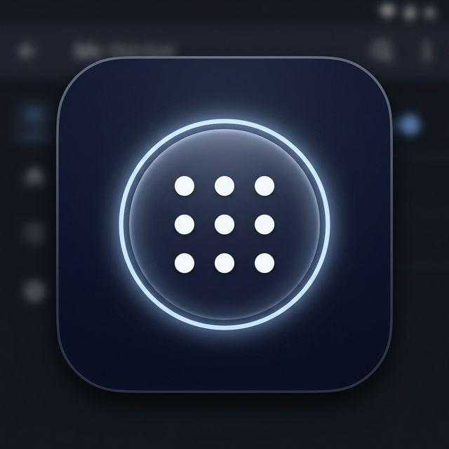

# Aether
<div align="center">
  
</div>

**Aether** is a lightweight, zero-dependency Android application that provides a persistent floating overlay for resource-constrained devices. It offers quick access to device volume controls and a one-touch screenshot functionality without relying on hardware buttons.

Designed specifically for older devices running Android 9 (API 28) with limited RAM, Aether ensures it stays alive in the background using multiple aggressive persistence strategies, so it's always ready when you need it.

---

## 🚀 Features

- **Floating Action Bubble**: A highly responsive, minimal 52dp canvas-drawn bubble that can be dragged anywhere and automatically snaps to the screen edges.
- **Volume Controls**: Quick buttons to adjust the volume up or down with long-press continuous adjustment.
- **Hardware-Free Screenshots**: Take screenshots via the Android MediaProjection API without pressing physical buttons. Screenshots are saved directly to your Picture/Screenshots directory.
- **Extreme Persistence**: Combines 5 survival strategies to stay alive even under heavy OS memory pressure:
  1. `START_STICKY` Foreground Service with an `IMPORTANCE_MIN` (invisible) notification.
  2. Partial `WAKE_LOCK` to keep the CPU awake.
  3. Continuous 5-minute `AlarmManager` watchdog to revive the service if killed.
  4. Auto-restarts when swiped from the recent apps list using `onTaskRemoved()`.
  5. Built-in flow to request Battery Optimization exemptions from the Android OS.
- **Zero Dependencies**: Built with 100% pure Kotlin and standard Android APIs. Not a single 3rd-party library is included, ensuring the APK remains under 2.5 MB.
- **No-XML UI**: The `ActionPanelView` and `BubbleView` are built entirely programmatically to save layout inflation overhead.

## 🛠️ Architecture and Tech Stack

- **Language**: Kotlin
- **Minimum SDK**: 28 (Android 9.0 Pie)
- **Target SDK**: 34
- **Core APIs**: `WindowManager` (for overlays), `MediaProjection` & `ImageReader` (for screenshots), `AudioManager` (for volume).

## 📸 Screenshots

*(Add your screenshots here)*

## 📥 Installation

1. Clone or download the repository.
   ```bash
   git clone https://github.com/Abrar-Labib-29/Project-Aether.git
   ```
2. Open the project in **Android Studio**.
3. Build the project and run on an Android device or emulator.
4. When launching the app for the first time, it will request **Storage** permission (required to save screenshots) and **Display over other apps** permission (required for the floating bubble).
5. (Optional but recommended) Allow Aether to ignore battery optimizations when prompted to ensure the overlay stays active indefinitely.

## 👨‍💻 Developed By

**Abrar Labib**
- Final Year Student at United International University
- [Linked Facebook Page](https://www.facebook.com/Abrar.Labib29/)
- Email: abrar.labib2829@gmail.com

## 📝 License

This project is open-source and available under the [MIT License](LICENSE).
